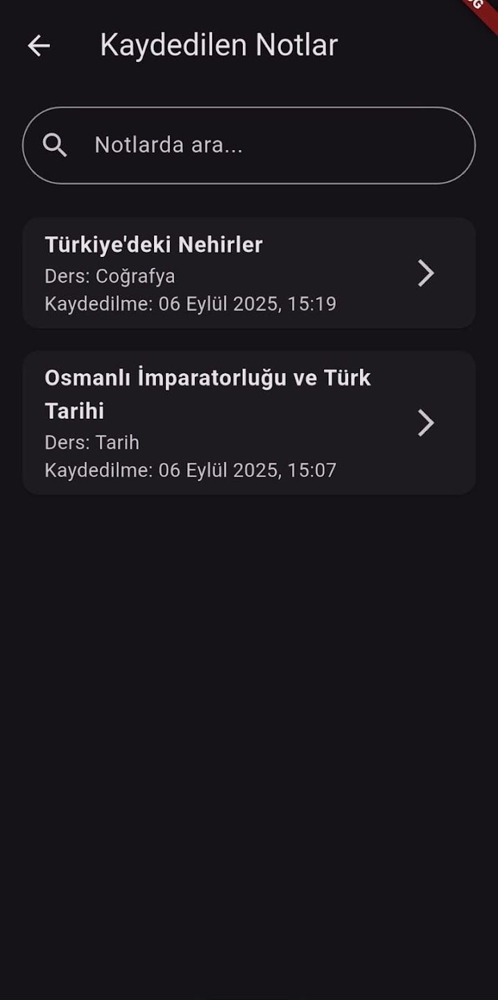
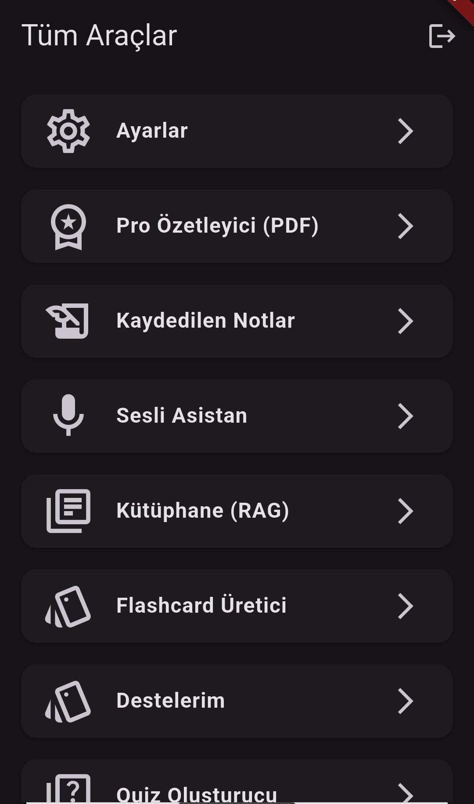
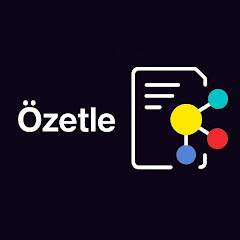

# Özetle – AI Learning Assistant

Özetle, lise müfredatına özel olarak tasarlanmış, metin, PDF, görsel ve ses girdilerinden
kişisel öğrenme materyalleri üreten yapay zeka destekli bir eğitim uygulamasıdır.

Uygulama; klasik özetleme araçlarının ötesine geçerek, yapılandırılmış bilgi üretimi,
konu bazlı analiz ve isteğe bağlı sesli etkileşim sunar.

---

## Features

- Text, PDF and image-based content summarization
- Subject-aware knowledge extraction (Biology, History, Geography, etc.)
- Flashcard generation for exam-oriented learning
- Quiz generation from extracted content
- RAG-based personal knowledge library
- Persistent note saving and search
- Optional real-time voice assistant
- Mobile-first UX (Flutter)

---

## Application Screenshots

### Saved Notes

### Tools & Modules

### Application Overview

---

## Technical Architecture

Özetle is built as a full-stack AI system with a modular and production-oriented design.

### Core Stack

- **Mobile:** Flutter (Android / iOS / Web)
- **Backend:** Python, Django REST Framework
- **AI / ML:** Gemini 2.5 Flash, FAISS, PyTorch
- **NLP:** DistilBERT, TF-IDF, Custom classifiers
- **Database:** Firebase (Auth, Firestore, Storage)
- **DevOps:** Cloudflare Tunnel, HTTPS, GitHub Actions

---

## AI & RAG System

### Retrieval-Augmented Generation (RAG)

- FAISS-based multilingual vector search
- Subject-weighted re-ranking for curriculum alignment
- Keyword guarantee + global fallback mechanism
- PDF text normalization and Unicode cleanup pipeline

### NLP Processing

- Content worthiness classification  
  (DistilBERT + Random Forest)
- Subject/domain classification using TF-IDF
- Named Entity Recognition for key concepts

---

## Voice Assistant Module (Optional)

Özetle includes an optional voice interaction module for hands-free usage.

- Speech-to-text input
- LLM reasoning via Gemini 2.5 Flash
- Text-to-speech synthesis using Coqui XTTS v2
- Short-answer enforced responses for low latency
- Temporary in-memory audio streaming (no storage usage)

Voice interaction is designed as a **supporting feature**, not a dependency.

---

## Project Status

- Actively developed
- Production-ready backend architecture
- Mobile application under continuous iteration

---

## Author

**Ahmet Koç**  
Computer Engineering Student  

- GitHub: https://github.com/osiass  
- LinkedIn: https://linkedin.com/in/ahmetk00  
- Email: ahmetkoc.iletisim@gmail.com
